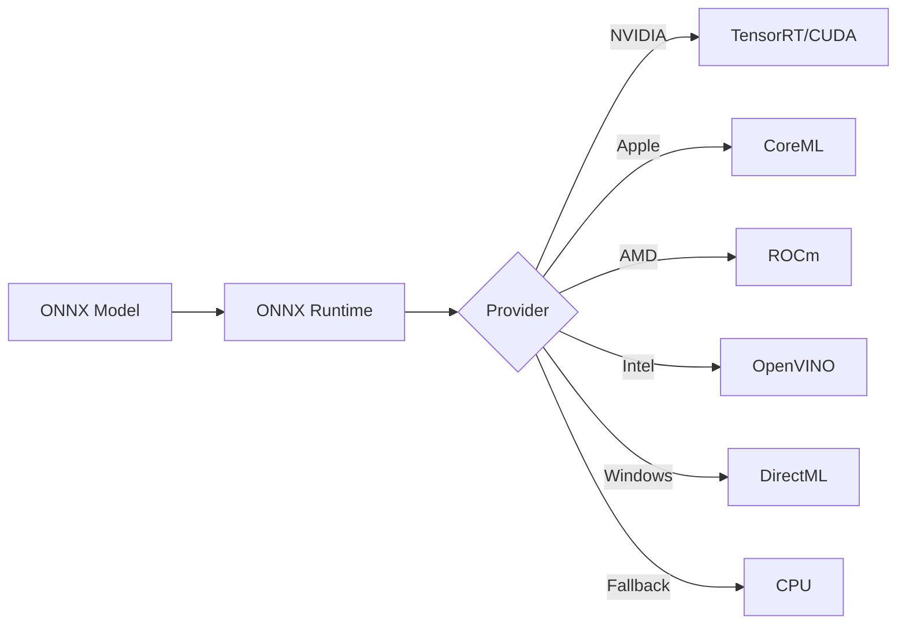

# GPU Providers

Understanding execution providers and how GPUX selects the best backend for your hardware.

---

## 🎯 What You'll Learn

- ✅ What execution providers are
- ✅ Available providers and platforms
- ✅ Provider selection logic
- ✅ Platform-specific optimization
- ✅ Troubleshooting provider issues

---

## 🧠 What are Execution Providers?

**Execution providers** are backends that execute ONNX models on specific hardware:



---

## 📋 Available Providers

### Priority Order

GPUX selects providers in this order:

1. **TensorrtExecutionProvider** - NVIDIA TensorRT (best performance)
2. **CUDAExecutionProvider** - NVIDIA CUDA
3. **ROCmExecutionProvider** - AMD ROCm
4. **CoreMLExecutionProvider** - Apple Silicon
5. **DirectMLExecutionProvider** - Windows DirectML
6. **OpenVINOExecutionProvider** - Intel OpenVINO
7. **CPUExecutionProvider** - CPU fallback

### Provider Details

| Provider | Hardware | OS | Performance |
|----------|----------|----|----|
| TensorRT | NVIDIA GPU | Linux, Windows | ⭐⭐⭐⭐⭐ |
| CUDA | NVIDIA GPU | Linux, Windows | ⭐⭐⭐⭐ |
| ROCm | AMD GPU | Linux | ⭐⭐⭐⭐ |
| CoreML | Apple Silicon | macOS | ⭐⭐⭐⭐ |
| DirectML | Any GPU | Windows | ⭐⭐⭐ |
| OpenVINO | Intel GPU/CPU | All | ⭐⭐⭐ |
| CPU | Any | All | ⭐⭐ |

---

## 🔍 Provider Selection

### Automatic Selection

GPUX automatically selects the best provider:

```yaml
runtime:
  gpu:
    backend: auto  # Automatic selection
```

### Manual Selection

Force a specific provider:

```bash
# Build with specific provider
gpux build . --provider cuda

# Or in gpux.yml
runtime:
  gpu:
    backend: cuda
```

### Check Selected Provider

```bash
gpux inspect model-name
```

---

## 🖥️ Platform-Specific Guides

### NVIDIA GPUs

**Requirements:**
- CUDA 11.8+ or 12.x
- cuDNN 8.x
- NVIDIA drivers 520+

**Install CUDA Runtime:**

```bash
# Check CUDA version
nvidia-smi

# Install ONNX Runtime GPU
pip install onnxruntime-gpu
```

**Configuration:**

```yaml
runtime:
  gpu:
    backend: cuda  # or tensorrt for best performance
    memory: 4GB
```

**TensorRT Optimization:**

```bash
# TensorRT provides 2-10x speedup
gpux build . --provider tensorrt
```

### Apple Silicon (M1/M2/M3)

**Requirements:**
- macOS 12.0+
- Apple Silicon Mac

**CoreML is built-in:**

```yaml
runtime:
  gpu:
    backend: coreml
    memory: 2GB
```

**Performance:**
- ✅ Excellent for small-medium models
- ✅ Low power consumption
- ✅ Unified memory architecture

### AMD GPUs

**Requirements:**
- ROCm 5.4+
- Supported AMD GPU

**Install ROCm Runtime:**

```bash
# Install ONNX Runtime with ROCm
pip install onnxruntime-rocm

# Verify ROCm
rocm-smi
```

**Configuration:**

```yaml
runtime:
  gpu:
    backend: rocm
    memory: 4GB
```

### Intel GPUs

**Requirements:**
- Intel GPU (integrated or Arc)
- OpenVINO toolkit

**Install OpenVINO:**

```bash
pip install onnxruntime-openvino
```

**Configuration:**

```yaml
runtime:
  gpu:
    backend: openvino
    memory: 2GB
```

### Windows (DirectML)

**Requirements:**
- Windows 10/11
- DirectX 12 compatible GPU

**DirectML works with:**
- NVIDIA GPUs
- AMD GPUs
- Intel GPUs

**Configuration:**

```yaml
runtime:
  gpu:
    backend: directml
    memory: 2GB
```

---

## ⚙️ Provider Configuration

### CUDA Configuration

```python
from gpux.core.providers import ProviderManager

manager = ProviderManager()
cuda_config = {
    'device_id': 0,  # GPU device ID
    'cudnn_conv_algo_search': 'EXHAUSTIVE',
    'do_copy_in_default_stream': True
}
```

### TensorRT Configuration

```python
tensorrt_config = {
    'trt_max_workspace_size': 1 << 30,  # 1GB
    'trt_fp16_enable': True,  # FP16 optimization
    'trt_engine_cache_enable': True  # Cache compiled engines
}
```

### CoreML Configuration

```python
coreml_config = {
    'coreml_flags': 0,  # Default settings
}
```

---

## 🔄 Fallback Behavior

If preferred provider fails, GPUX falls back to CPU:

```
TensorRT → CUDA → CPU
          ↓
      (if failed)
```

Example:
```bash
# Try CUDA, fallback to CPU if not available
gpux build . --provider cuda
```

---

## 🐛 Troubleshooting

### Provider Not Available

**Check available providers:**

```python
import onnxruntime as ort
print(ort.get_available_providers())
```

**Install missing provider:**

```bash
# NVIDIA
pip install onnxruntime-gpu

# AMD
pip install onnxruntime-rocm

# Intel
pip install onnxruntime-openvino
```

### Provider Selection Failed

**Error:** `No execution providers available`

**Solution:**
1. Verify drivers installed
2. Check ONNX Runtime version
3. Try CPU fallback

```bash
gpux build . --provider cpu
```

### Performance Issues

**Compare providers:**

```bash
# Benchmark each provider
gpux build . --provider cuda
gpux run model --benchmark --runs 1000

gpux build . --provider cpu
gpux run model --benchmark --runs 1000
```

---

## 📊 Performance Comparison

Example inference times for ResNet-50:

| Provider | Time (ms) | Speedup |
|----------|-----------|---------|
| TensorRT | 2.1 | 47x |
| CUDA | 4.5 | 22x |
| CoreML | 8.3 | 12x |
| DirectML | 15.2 | 6.5x |
| OpenVINO | 18.7 | 5.3x |
| CPU | 98.5 | 1x |

*Results vary by hardware and model*

---

## 💡 Key Takeaways

!!! success "What You Learned"
    ✅ Execution providers explained
    ✅ Provider priority and selection
    ✅ Platform-specific setup
    ✅ Configuration options
    ✅ Troubleshooting provider issues
    ✅ Performance comparison

---

**Previous:** [Models](models.md) | **Next:** [Inputs & Outputs →](inputs-outputs.md)
