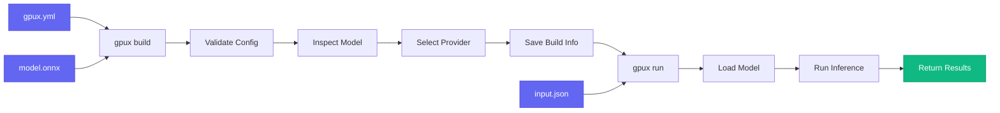

# First Steps

Create your first GPUX project and run inference in under 10 minutes!

---

## 🎯 What You'll Build

By the end of this guide, you'll have:

- ✅ A working GPUX project
- ✅ A simple ONNX model
- ✅ A `gpux.yml` configuration file
- ✅ Successfully run inference

---

## 📁 Project Setup

### Create Project Directory

```bash
# Create and navigate to project directory
mkdir my-first-model
cd my-first-model
```

---

## 🧪 Create a Simple ONNX Model

For this tutorial, we'll create a simple linear regression model. Don't worry if you're not familiar with machine learning - this is just for demonstration!

### Option 1: Using PyTorch (Recommended)

Create a file named `create_model.py`:

```python
"""Create a simple ONNX model for GPUX tutorial."""
import torch
import torch.nn as nn

# Define a simple linear model
class SimpleModel(nn.Module):
    def __init__(self):
        super().__init__()
        self.linear = nn.Linear(10, 2)  # 10 inputs, 2 outputs

    def forward(self, x):
        return self.linear(x)

# Create model instance
model = SimpleModel()
model.eval()

# Create dummy input
dummy_input = torch.randn(1, 10)

# Export to ONNX
torch.onnx.export(
    model,
    dummy_input,
    "model.onnx",
    input_names=["input"],
    output_names=["output"],
    dynamic_axes={
        "input": {0: "batch_size"},
        "output": {0: "batch_size"}
    }
)

print("✅ Model exported to model.onnx")
```

Run the script:

```bash
# Install PyTorch if needed
uv add torch

# Create the model
python create_model.py
```

### Option 2: Download Example Model

Alternatively, download a pre-made example model:

```bash
# Download example model (sentiment analysis)
curl -o model.onnx https://github.com/onnx/models/raw/main/vision/classification/mobilenet/model/mobilenetv2-7.onnx
```

!!! tip "Using Your Own Model"
    If you already have an ONNX model, just copy it to this directory and rename it to `model.onnx`.

---

## 📝 Create Configuration File

Now create a `gpux.yml` file to configure your model:

```yaml
# gpux.yml - Configuration for GPUX
name: my-first-model
version: 1.0.0
description: "My first GPUX model"

model:
  source: ./model.onnx
  format: onnx

inputs:
  input:
    type: float32
    shape: [1, 10]
    required: true
    description: "10-dimensional input vector"

outputs:
  output:
    type: float32
    shape: [1, 2]
    description: "2-dimensional output vector"

runtime:
  gpu:
    memory: 2GB
    backend: auto  # Automatically select best GPU
  batch_size: 1
  timeout: 30
```

!!! info "Configuration Explained"
    - `name`: Your model's name (used in CLI commands)
    - `model.source`: Path to your ONNX model file
    - `inputs`: Define input tensor specifications
    - `outputs`: Define output tensor specifications
    - `runtime`: GPU and performance settings

---

## 🏗️ Build Your Model

Validate and build your GPUX project:

```bash
gpux build .
```

Expected output:

```
╭─ Model Information ─────────────────────────────────────╮
│ Name      │ my-first-model                              │
│ Version   │ 1.0.0                                       │
│ Format    │ onnx                                        │
│ Size      │ 0.1 MB                                      │
│ Inputs    │ 1                                           │
│ Outputs   │ 1                                           │
╰─────────────────────────────────────────────────────────╯

╭─ Execution Provider ────────────────────────────────────╮
│ Provider    │ CoreMLExecutionProvider                   │
│ Platform    │ Apple Silicon                             │
│ Available   │ ✅ Yes                                    │
│ Description │ Optimized for Apple devices              │
╰─────────────────────────────────────────────────────────╯

✅ Build completed successfully!
Build artifacts saved to: .gpux
```

!!! tip "What Just Happened?"
    GPUX:
    1. ✅ Validated your `gpux.yml` configuration
    2. ✅ Inspected your ONNX model
    3. ✅ Detected the best GPU provider (or CPU)
    4. ✅ Saved build artifacts to `.gpux/` directory

---

## 🚀 Run Your First Inference

Now let's run inference on your model!

### Create Input Data

Create a file named `input.json`:

```json
{
  "input": [[1.0, 2.0, 3.0, 4.0, 5.0, 6.0, 7.0, 8.0, 9.0, 10.0]]
}
```

### Run Inference

```bash
gpux run my-first-model --file input.json
```

Expected output:

```json
{
  "output": [
    [0.123, -0.456]
  ]
}
```

!!! success "Congratulations! 🎉"
    You just ran your first inference with GPUX!

### Alternative: Inline Input

You can also provide input directly via the command line:

```bash
gpux run my-first-model --input '{"input": [[1,2,3,4,5,6,7,8,9,10]]}'
```

---

## 🔍 Inspect Your Model

Get detailed information about your model:

```bash
gpux inspect my-first-model
```

Expected output:

```
╭─ Model Information ─────────────────────────────────────╮
│ Name      │ my-first-model                              │
│ Version   │ 1.0.0                                       │
│ Path      │ ./model.onnx                                │
│ Size      │ 0.1 MB                                      │
╰─────────────────────────────────────────────────────────╯

╭─ Input Specifications ──────────────────────────────────╮
│ Name  │ Type    │ Shape     │ Required │
│ input │ float32 │ [1, 10]   │ ✅       │
╰─────────────────────────────────────────────────────────╯

╭─ Output Specifications ─────────────────────────────────╮
│ Name   │ Type    │ Shape    │
│ output │ float32 │ [1, 2]   │
╰─────────────────────────────────────────────────────────╯

╭─ Runtime Information ───────────────────────────────────╮
│ Provider  │ CoreMLExecutionProvider                     │
│ Backend   │ auto                                        │
│ GPU Memory│ 2GB                                         │
╰─────────────────────────────────────────────────────────╯
```

---

## 📂 Your Project Structure

After completing these steps, your project should look like this:

```
my-first-model/
├── model.onnx           # Your ONNX model
├── gpux.yml             # GPUX configuration
├── input.json           # Sample input data
├── create_model.py      # Model creation script (optional)
└── .gpux/               # Build artifacts (auto-generated)
    ├── model_info.json
    └── provider_info.json
```

---

## 🎓 Understanding the Workflow

Here's what happens when you run GPUX commands:



---

## ✨ Try These Next

Now that you have a working GPUX project, try these exercises:

### 1. Change Input Values

Edit `input.json` and run inference again:

```json
{
  "input": [[10, 9, 8, 7, 6, 5, 4, 3, 2, 1]]
}
```

```bash
gpux run my-first-model --file input.json
```

### 2. Save Output to File

Save inference results to a file:

```bash
gpux run my-first-model --file input.json --output result.json
cat result.json
```

### 3. Use Different Providers

Try forcing a specific provider:

```bash
# Use CPU provider
gpux build . --provider cpu

# Verify the change
gpux inspect my-first-model
```

---

## 🐛 Troubleshooting

### Model file not found

**Error**: `Model file not found: ./model.onnx`

**Solution**: Make sure `model.onnx` exists in your project directory:

```bash
ls -lh model.onnx
```

### Input validation failed

**Error**: `Input mismatch. Missing: {'input'}`

**Solution**: Check your input data matches the expected format:

```bash
# Verify input specification
gpux inspect my-first-model

# Ensure input.json has the correct key names
cat input.json
```

### Invalid YAML

**Error**: `Invalid YAML in configuration file`

**Solution**: Validate your `gpux.yml` syntax:

```bash
# Check YAML syntax
python -c "import yaml; yaml.safe_load(open('gpux.yml'))"
```

---

## 📚 What's Next?

Great job! You've successfully created and run your first GPUX model. 🎉

Continue learning:

- **[Configuration →](configuration.md)** - Deep dive into `gpux.yml` options
- **[Running Inference →](running-inference.md)** - Advanced inference techniques
- **[Benchmarking →](benchmarking.md)** - Measure model performance

---

## 💡 Key Takeaways

!!! success "What You Learned"
    ✅ How to create an ONNX model
    ✅ How to write a `gpux.yml` configuration
    ✅ How to build a GPUX project with `gpux build`
    ✅ How to run inference with `gpux run`
    ✅ How to inspect model information with `gpux inspect`

---

**Previous:** [Installation](installation.md) | **Next:** [Configuration](configuration.md)
